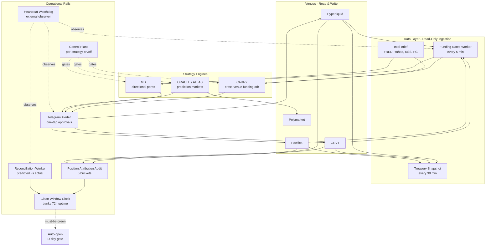
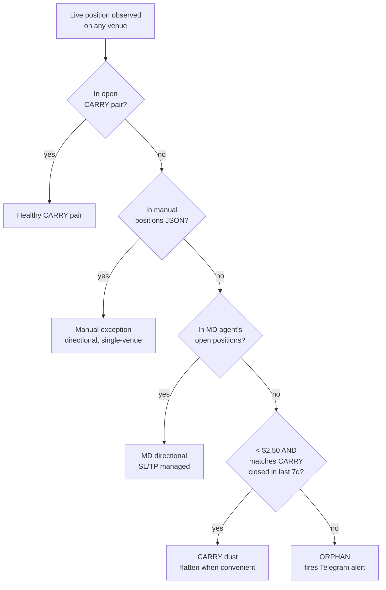
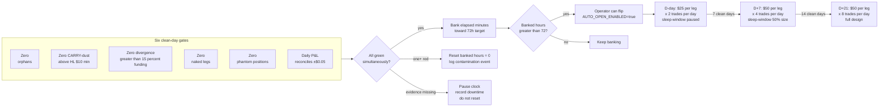

# BABA Capital Engine — Architecture

System organised in three concentric rings: **data sources** (read-only ingestion),
**strategy logic** (the three strategy engines), and **operational rails** (treasury,
reporting, kill switches, control plane). Each ring talks to the others only through
JSON snapshots + sqlite databases on disk — no in-process coupling, so any worker
can be restarted independently without dragging the others down.

---

## High-level diagram



---

## Position attribution — five-bucket classifier

Every position observed on any venue gets sorted into exactly one of five buckets.
Only **orphans** fire a Telegram alert; the other four are surfaced visually but
never alarm. Built after a near-miss where dust from a recently-closed CARRY pair
got mis-flagged as an unattributed leg.



---

## Auto-open graduation gate

How a one-tap manual approval workflow graduates to fully-automated open. The
three columns are independent — each runs continuously, and they must ALL stay
green for 72 hours of operational uptime before the gate flips.



---

## Control plane — per-strategy on/off

Designed but deferred to post-graduation. The catalogue (`strategies_catalogue/*.yaml`)
is the single source of truth for what's runnable. Each strategy registers its
metadata, risks, on/off semantics, and supported venues there. Adding a future
strategy (YIELD, AIRDROP, OPTIONS, etc.) is a config change, not a code change.

```mermaid
flowchart LR
    subgraph cat [strategies_catalogue/]
        MDYML[md.yaml]
        CARRYYML[carry.yaml]
        ORACLEYML[oracle.yaml]
        FUTURE1[yield.yaml?]
        FUTURE2[airdrop.yaml?]
    end

    cat --> STATE[strategy_state.sqlite<br/>per user × strategy × venue]
    STATE --> AGENTS[Agents check state<br/>at top of every tick]

    subgraph commands [Telegram surface]
        SLASH1[/strategies]
        SLASH2[/md off carry hl off etc.]
        SLASH3[/killswitch]
    end
    commands --> STATE

    STATE --> AUDIT[strategy_audit_log<br/>every flip with who/when/why]

    AGENTS -- live --> RUN[Execute normally]
    AGENTS -- paper --> LOGONLY[Log decisions<br/>no execution]
    AGENTS -- off --> PAUSE[Block new entries<br/>hold existing]
    AGENTS -- drain --> CLOSE[Block new entries<br/>close on next opportunity]
```
